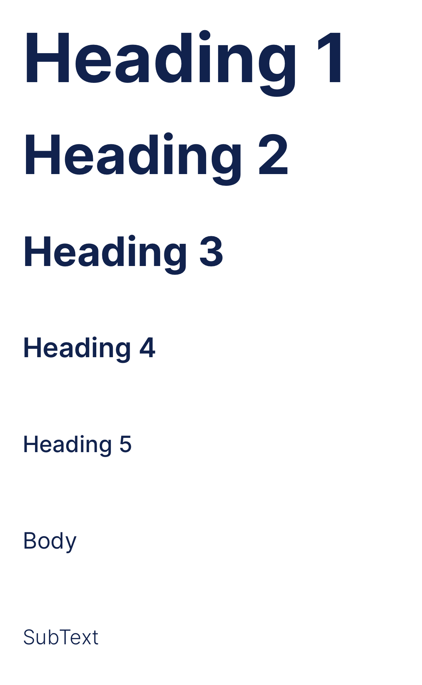

# WISECities UIKit Components

**Abstract:** Documentation of custom UIKit reusable components for WISECities mobile app.
 
 **Version:** 1.0
 
**IMPORTANT:** You are not allowed to copy any portion of this documentation or redistribute with or without modifications.

## Colors
Following the naming convention of `UIColor.systemMint` we define the application colors as the following: `.applicationOxfordBlue` .

With the help of autocompletion all colors can be found quite easily and can be avoid mistyping. 

**Available colors:**

-  `.applicationOxfordBlue`           with HEX of `#11224D`
-  `.applicationOxfordBlueHighligted`           with HEX of `#0A132C`
-  `.applicationGlaucous`               with HEX of `#5B84C4`
-  `.applicationRhythm`               with HEX of `#687086`
-  `.applicationAtomicTangerine`       with HEX of `#F79653`
-  `.applicationPistachio`          with HEX of `#A6CC80`
-  `.applicationCultured`              with HEX of `#F6F4F3`
-  `.applicationMaizeCrayola`       with HEX of `#F2C864`
-  `.applicationFrenchBlueSky`       with HEX of `#8AB6E9`


**Usage:**
```swift
import WISEComponents

override func viewDidLoad() {
    view.backgroundColor = .applicationOxfordBlue
}
```

## Fonts
Custom font for the application is `Inter`.




**Available Type layouts:**
- `heading1`: Inter Bold - 60px
- `heading2`: Inter Bold - 48px
- `heading3`: Inter Bold - 36px
- `heading4`: Inter Semi Bold - 24px
- `heading5`: Inter Medium - 20px
- `body`: Inter Regular - 20px
- `subText`: Inter Light - 18px

**Usage:**

```swift
import WISEComponents

init() {
    WISEComponents.registerFonts()
}

override func viewDidLoad() {
    let label = UILabel()
    label.font = .heading1
}
```
